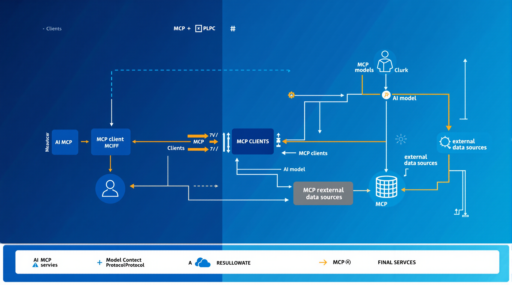
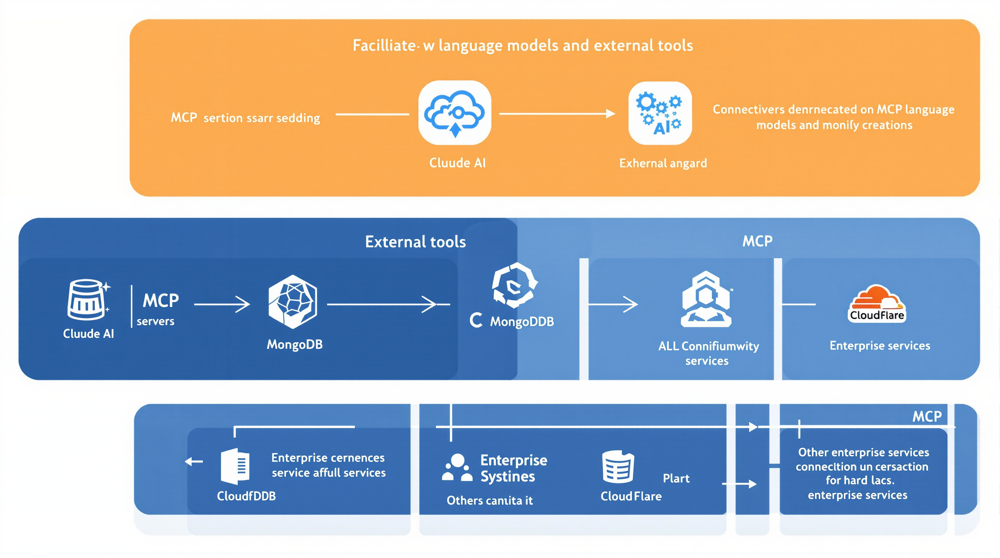

# The Evolution of MCP Servers: A Comprehensive Look at Recent Developments

In the rapidly evolving landscape of artificial intelligence, the Model Context Protocol (MCP) has emerged as a game-changing technology, revolutionizing how AI systems connect with external tools and data sources. This post explores the latest developments in MCP servers, their significance, and how they're transforming the AI ecosystem.

## What is the Model Context Protocol (MCP)?

The Model Context Protocol is an open standard developed by Anthropic in late 2024 that standardizes how AI models interact with external data sources and tools. Unlike traditional AI systems that operate in isolation with only the data they were trained on, MCP creates a bridge between AI models and the external world, allowing them to access real-time information, interact with databases, and utilize various tools.

MCP works through a client-server architecture:

- **MCP Hosts**: Applications like Claude.ai that use AI models
- **MCP Clients**: Secure intermediaries that connect to servers
- **MCP Servers**: Lightweight programs that expose various information sources and tools to AI systems

This architecture enables AI assistants to access both local files and distant web APIs, fundamentally transforming how AI interacts with our digital ecosystem.

## Recent Developments in MCP Servers

### Cloudflare's Thirteen New MCP Servers

On May 1, 2025, Cloudflare announced thirteen new publicly available remote MCP servers. These servers allow MCP clients like Claude.ai, Cursor, and Windsurf to interact with Cloudflare services through natural language interfaces. Some of the most notable servers include:

1. **Cloudflare Documentation Server**: Provides real-time access to Cloudflare's up-to-date documentation
2. **Workers Bindings Server**: Enables interaction with development resources like D1 databases and R2 object storage
3. **Workers Observability Server**: Helps with application debugging by providing insight into logs and analytics

This suite of MCP servers unlocks Cloudflare tools, resources, and real-time information, making them accessible through conversational AI interfaces.

### Remote MCP Servers: The Next Evolution

While MCP initially required local server installations, we're now seeing a shift toward remote MCP servers accessible via URL. This advancement, driven by Cloudflare's innovation, simplifies integration and expands the potential user base. Remote MCP servers offer several advantages:

- **Easier Deployment**: One-click solutions for setting up MCP connections
- **Broader Access**: More users can connect without technical setup
- **Enterprise Integration**: Entire organizations can access the same MCP servers

Cloudflare has also added support for Streamable HTTP transport, simplifying AI agent communication with services using a single HTTP endpoint, and enabled building MCP servers entirely in Python using Cloudflare Workers.

### MongoDB MCP Server

MongoDB has released their Model Context Protocol Server in public preview, allowing AI-powered development tools to connect to MongoDB databases using natural language. This enables developers to:

- Perform database operations through natural language queries
- Explore schemas without writing code
- Manage users and permissions conversationally
- Generate context-aware database code

The MongoDB MCP Server supports integration with various AI tools including Windsurf, Cursor, GitHub Copilot, and Claude.

### Atlassian's Remote MCP Server

Atlassian has launched a beta version of its Remote MCP Server that bridges Atlassian's enterprise knowledge (Jira and Confluence data) with external AI tools. Users can interact with their Atlassian data directly within AI assistants like Claude, enabling capabilities such as:

- Summarizing Jira items and Confluence pages
- Creating new items through conversation
- Performing multi-step actions across different Atlassian products
- Enriching data with context from other sources

### PayPal MCP Integration

PayPal has begun rolling out MCP servers to accelerate development, starting with invoice creation. This allows merchants to use AI tools to create invoices conversationally through plain-language prompts, streamlining the process and making it more user-friendly.

## Why MCP Servers Matter

The proliferation of MCP servers represents a fundamental shift in how we interact with AI systems. Here's why these developments are significant:

### 1. Breaking Down Information Silos

MCP servers eliminate the isolation of AI models, allowing them to access the most current information and tools. This means AI assistants can provide more accurate, up-to-date responses by pulling from live data sources.

### 2. Standardized Integration

Rather than building custom connections for each AI system and data source (an M×N problem), MCP creates a standard protocol that simplifies integration (transforming it into an M+N problem). This accelerates development and reduces complexity.

### 3. Enhanced Security and Control

Organizations can keep sensitive data within their infrastructure while still enabling AI systems to access and process it. This addresses critical data privacy and security concerns that have limited AI adoption in enterprise settings.

### 4. Enabling AI Agents

With MCP, AI systems can move beyond responding to queries and actually perform actions—sending emails, updating databases, or managing infrastructure. This enables truly agentic systems that can accomplish tasks autonomously.

## The Future of MCP Servers

As the MCP ecosystem continues to grow, we can expect several trends to emerge:

### 1. Industry-Specific MCP Servers

We're likely to see specialized MCP servers tailored to specific industries like healthcare, finance, legal, and education, with pre-built integrations to domain-specific tools and data sources.

### 2. MCP Marketplaces

Similar to app stores, MCP server marketplaces could emerge where developers can discover, deploy, and possibly monetize specialized MCP servers.

### 3. Enhanced Privacy Features

As MCP adoption grows, we'll see more sophisticated privacy controls that allow fine-grained permission settings for what data AI systems can access and what actions they can perform.

### 4. Cross-Platform Consistency

As users interact with AI across different platforms and devices, MCP will help maintain consistent context, allowing for seamless experiences that carry over from one interaction to the next.

## Getting Started with MCP

If you're interested in exploring MCP:

1. **For users**: Claude.ai supports connecting to MCP servers through the Claude Desktop app
2. **For developers**: Check out [Anthropic's MCP documentation](https://docs.anthropic.com/en/docs/agents-and-tools/mcp) or explore Cloudflare's [remote MCP servers](https://blog.cloudflare.com/remote-model-context-protocol-servers-mcp/)
3. **For enterprises**: Look into existing MCP servers from companies like MongoDB, Atlassian, and Cloudflare to enhance your workflow

## Conclusion

MCP servers represent a paradigm shift in AI capabilities, moving from isolated systems trained on static data to connected assistants that can access real-time information and interact with the digital world. The recent announcements from Cloudflare, MongoDB, Atlassian, and PayPal highlight the growing momentum behind this technology.

As more organizations develop and deploy MCP servers, we'll see AI assistants become more capable, more current, and more useful in our day-to-day work. The future of AI isn't just about smarter models—it's about more connected ones.

The proliferation of MCP servers is just beginning, and the potential applications are vast. As this ecosystem matures, it will fundamentally transform how we interact with AI and how AI interacts with our digital world.